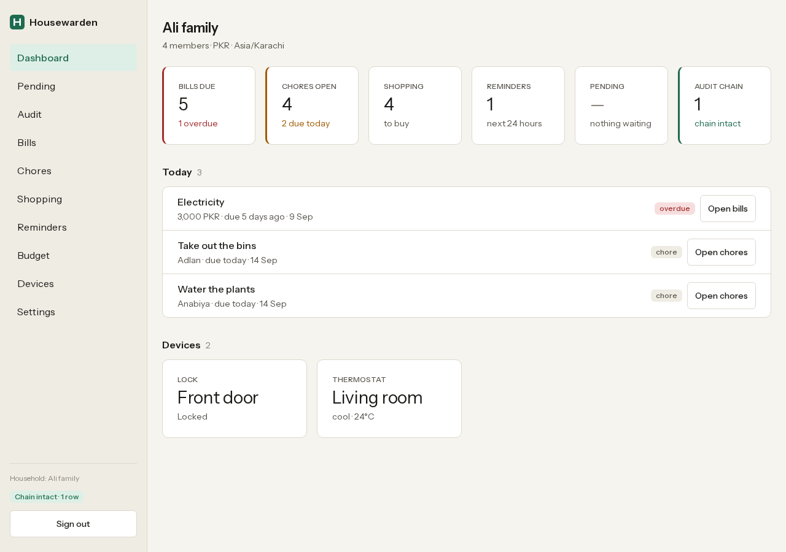
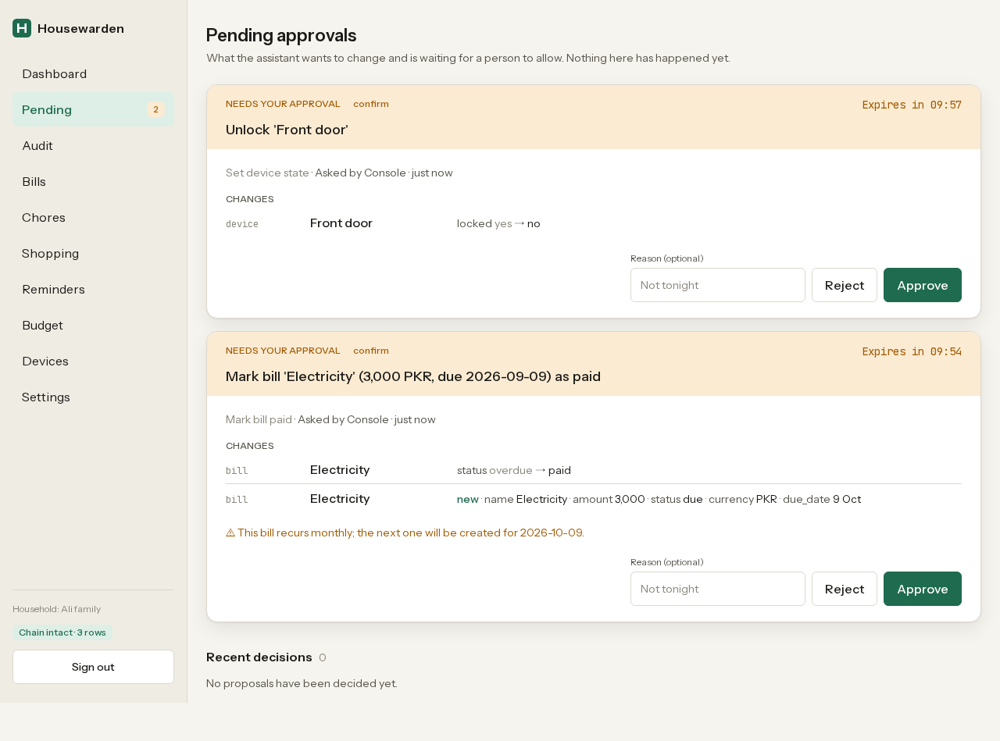
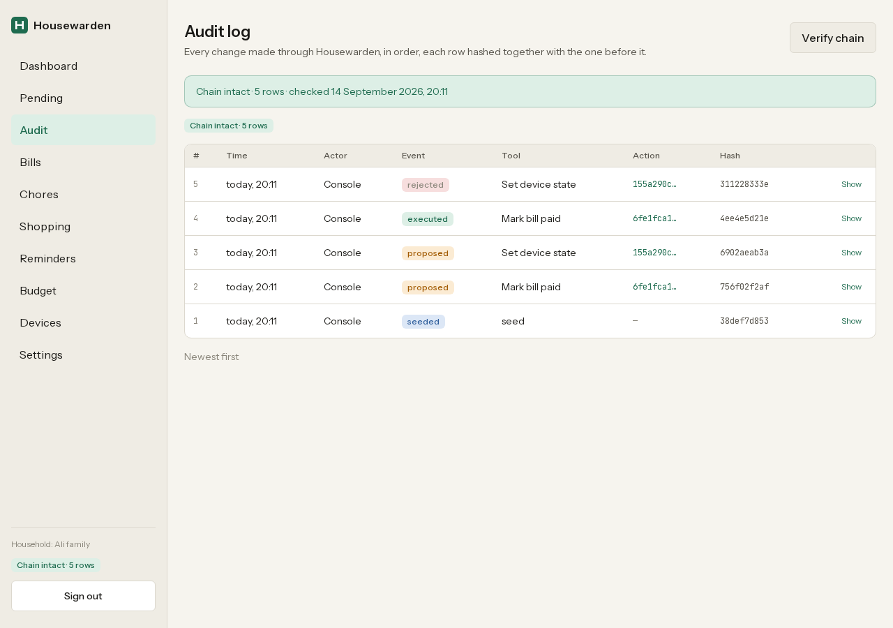
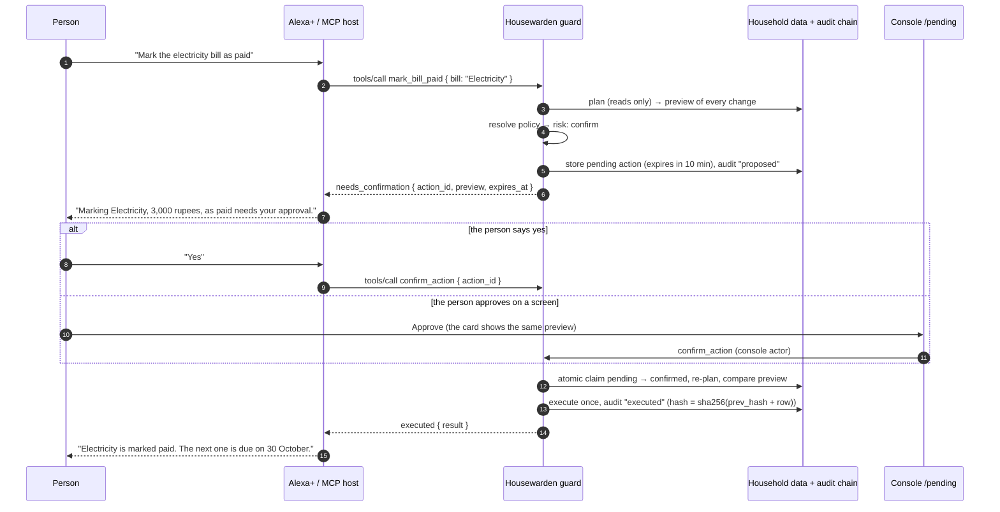

# Housewarden

**A household-operations MCP server where every action that changes something is previewed, confirmed and audited.** Built for Alexa+ and any MCP host that speaks Streamable HTTP.

Housewarden runs one household — bills, chores, shopping, reminders, budget, simulated smart-home devices and routines, members — behind 31 MCP tools. Reads are free. Every mutating tool goes through **one guard**: it produces a dry-run preview of exactly what will change, asks a person when the action is risky, executes exactly once, and appends to a hash-chained audit log. The web console uses the same path, so an assistant can never reach a weaker one than a person can.

## Why this exists

A home assistant is about to be handed real actions: pay this bill, unlock the door, clear the shopping list. The missing piece is not the tools; it is the safety layer around them — *show me what will change before it changes, ask me, and keep a tamper-evident record.* Housewarden is that layer, shipped as a complete product rather than a demo: self-hosted, zero-setup, open source (MIT).

## Demo video

**Watch:** https://youtu.be/3zZOKYgpXVw (YouTube, under three minutes, English captions burned in) — the same file is in the repo as [`demo/housewarden-demo.mp4`](demo/housewarden-demo.mp4). Shot list and every caption: [`demo/script.md`](demo/script.md). It was recorded with Playwright driving the real console and a real MCP client (`demo/record.mjs`); nothing in it is mocked.

| Dashboard | Pending approval | Audit chain |
|---|---|---|
| [](docs/screens/dashboard-1280.png) | [](docs/screens/pending-1280.png) | [](docs/screens/audit-1280.png) |

## Quickstart — 90 seconds, nothing but Node 20+

```bash
git clone https://github.com/buildwithabid/housewarden
cd housewarden
npm install
npm run dev
```

The first start:

1. writes `.env.local` with a random **`HOUSEWARDEN_TOKEN`** (the bearer token MCP clients send) and **`HOUSEWARDEN_ADMIN_SECRET`** (the console login), and prints both once;
2. creates an embedded Postgres (PGlite) in `.data/pglite` and applies the schema;
3. asks `Load the demo household (Ali family)? (Y/n)` — press Enter;
4. starts Next.js on http://localhost:3000.

Then:

- **Open the console**: http://localhost:3000 → sign in with the admin secret. The dashboard shows today's due items, the pending-approvals badge and "Chain intact". If you skipped step 3, press **Load demo data**.
- **Connect a client** to `http://localhost:3000/api/mcp` with header `Authorization: Bearer <HOUSEWARDEN_TOKEN>` (see [Connect Alexa+ or any MCP host](#connect-alexa-or-any-mcp-host)).
- **Watch it work without a host**: `npm run demo:client -- --auto-approve` narrates the four-step demo in the terminal; `npm run e2e` drives the server with a real MCP client and prints a pass/fail table.

## How the guard works

Every mutating tool accepts `dry_run` (preview only) and `idempotency_key` (safe retries). Its result is always one of `executed`, `needs_confirmation` or `dry_run`, and always includes the preview — a list of concrete change lines such as `bill 'Electricity' 3,000 PKR due 2026-09-30: status overdue → paid`.



What the diagram does not show, but the code does:

- **Risk levels** come from policies: `read` (never guarded), `low` (executes immediately, audited), `confirm` (a person approves in the console *or* the assistant calls `confirm_action` after the user says yes), `high` (only the console can approve). Defaults: adds and updates are `low`; money-moving and destructive tools (`mark_bill_paid`, `clear_shopping_list`, `run_routine`, `add_member`, unlocking a lock) are `confirm`; `set_policy` is `high`, so an assistant can never lower the guard and approve its own change in one conversation. Per-member overrides exist (in the demo, a child unlocking the front door is `high`).
- **Exactly once.** `confirm_action` claims the row atomically under an advisory lock; a second call returns the stored result with `idempotent_replay: true`. If the household changed between proposal and approval, the re-planned preview no longer matches and the action fails with `STALE_PREVIEW` instead of doing something the person did not see.
- **Nothing hidden.** Dry runs write nothing. Proposals, executions, rejections and expiries each append an audit row whose hash covers the previous row's hash; `verify_audit_chain` recomputes the whole chain and the console shows "Chain intact · N rows".
- **No timers, no sessions.** Expiry is swept on access; the pending action *is* the session, so the server stays stateless and any number of hosts can talk to it.

## The tools

31 tools: 12 read, 17 mutating (all through the guard), 2 guard. Every tool has a title, a two-sentence description written for a voice assistant, a zod input schema, an output schema (SDK v2 `structuredContent`) and a spoken one-liner in `content[0].text`. Full shapes and examples are in [docs/TOOLS.md](docs/TOOLS.md).

| # | Tool | Kind | Default risk | What it does |
|---|---|---|---|---|
| 1 | `list_members` | read | read | Lists the people in the household with their roles. |
| 2 | `get_household_summary` | read | read | Gives a spoken-ready overview of what is due, overdue, waiting for approval and whether the audit log is intact. |
| 3 | `list_bills` | read | read | Lists bills, unpaid ones by default, soonest first. |
| 4 | `get_bill` | read | read | Reads one bill in detail. |
| 5 | `list_chores` | read | read | Lists chores, open ones by default, with who they are assigned to. |
| 6 | `list_shopping` | read | read | Lists what is still to buy, grouped by category. |
| 7 | `list_reminders` | read | read | Lists upcoming reminders, soonest first. |
| 8 | `list_devices` | read | read | Lists the smart-home devices with their current state, and the routines that can be run. |
| 9 | `get_budget_summary` | read | read | Summarises spending for a month by category, with the previous month for comparison. |
| 10 | `list_pending_actions` | read | read | Lists actions waiting for approval, with what each would change and when it expires. |
| 11 | `get_audit_log` | read | read | Reads the tamper-evident audit log, newest first. |
| 12 | `verify_audit_chain` | read | read | Recomputes every hash in the audit log and reports whether the chain is intact. |
| 13 | `add_member` | mutating | confirm | Adds a person to the household as an adult or a child. |
| 14 | `add_bill` | mutating | low | Adds a bill with an amount and due date, optionally recurring. |
| 15 | `update_bill` | mutating | low | Changes a bill's name, amount, currency, due date or recurrence. |
| 16 | `mark_bill_paid` | mutating | confirm | Marks a bill as paid and, if it recurs, creates the next one. |
| 17 | `add_chore` | mutating | low | Adds a chore, optionally assigned to someone and repeating. |
| 18 | `assign_chore` | mutating | low | Assigns a chore to a member, or unassigns it. |
| 19 | `complete_chore` | mutating | low | Marks a chore done and, if it repeats, schedules the next one. |
| 20 | `rotate_chores` | mutating | low | Rotates every open, assigned chore to the next member in the household order. |
| 21 | `add_shopping_item` | mutating | low | Adds an item to the shopping list with a quantity and category. |
| 22 | `check_off_shopping_item` | mutating | low | Checks an item off the shopping list. |
| 23 | `clear_shopping_list` | mutating | confirm | Removes checked-off items from the shopping list, or everything if asked. |
| 24 | `add_reminder` | mutating | low | Adds a reminder at a specific time, optionally for one member. |
| 25 | `cancel_reminder` | mutating | low | Cancels a scheduled reminder. |
| 26 | `record_expense` | mutating | low | Records money spent in a category for the budget. |
| 27 | `set_device_state` | mutating | low (locks: confirm) | Changes a device's state, such as locking a door or setting a thermostat. |
| 28 | `run_routine` | mutating | confirm | Runs a saved routine, applying each of its steps together. |
| 29 | `set_policy` | mutating | high | Changes how much confirmation a tool needs, for everyone or for one member. |
| 30 | `confirm_action` | guard | — | Approves a waiting action so it runs exactly once. |
| 31 | `reject_action` | guard | — | Declines a waiting action so it never runs. |

Mutating tools also accept `dry_run: boolean`, `idempotency_key: string` and `member` (who is asking — a name or id, used for per-member policies and the audit trail).

## Connect Alexa+ or any MCP host

Housewarden is a **self-hosted MCP server over Streamable HTTP**, the transport Alexa+ integrations use. It serves the MCP **2025-11-25** revision (and earlier 2025 Streamable HTTP clients) and the **2026-07-28** revision natively, from one endpoint, with no sessions to manage.

**Endpoint shape**

```
POST https://<your-host>/api/mcp
Authorization: Bearer <HOUSEWARDEN_TOKEN>
Content-Type: application/json
Accept: application/json, text/event-stream
```

- The token is the only credential. There is no OAuth flow to set up: paste the token from `.env.local` wherever the host asks for an authorization header or bearer token.
- Browser-based hosts send an `Origin` header; add that origin to `HOUSEWARDEN_ALLOWED_ORIGINS` (comma-separated full origins) or the request is refused with 403. Native and server-side hosts send no `Origin` and need nothing.
- `GET /api/mcp` answers 405: serving is stateless, so there is no server-initiated stream to open.

**Alexa+.** In the Alexa+ developer configuration for a self-hosted MCP server, supply the endpoint URL (`https://<your-host>/api/mcp`) and the `Authorization: Bearer <token>` header. The server's `instructions` tell the assistant what to do with a `needs_confirmation` reply: read the spoken line, wait for an explicit yes, then call `confirm_action`; on no, call `reject_action`; never confirm without the user's yes; say so when an action can only be approved in the console. Tool descriptions are written to be spoken.

**Any MCP host with a JSON config** (Claude Code, Cursor, VS Code, Windsurf and others use this shape):

```json
{
  "mcpServers": {
    "housewarden": {
      "type": "http",
      "url": "https://<your-host>/api/mcp",
      "headers": {
        "Authorization": "Bearer hw_…"
      }
    }
  }
}
```

**Stdio-only hosts** (Claude Desktop and similar) can bridge with [`mcp-remote`](https://www.npmjs.com/package/mcp-remote):

```json
{
  "mcpServers": {
    "housewarden": {
      "command": "npx",
      "args": ["-y", "mcp-remote", "https://<your-host>/api/mcp", "--header", "Authorization: Bearer hw_…"]
    }
  }
}
```

**Hosts that must launch the server themselves** (Claude Desktop without a bridge, `mcp-proxy`, and directories that build and inspect the server, such as Glama) can use the native stdio entry point. It serves the same 31 tools, guard and audit chain straight over stdio - no HTTP hop and no bearer token, because the client is the process that started it - and writes nothing but JSON-RPC to stdout:

```bash
npm ci
npm run stdio                    # = tsx scripts/stdio.ts
```

**From a terminal**, to see the raw protocol:

```bash
curl -s http://localhost:3000/api/mcp \
  -H "Authorization: Bearer $HOUSEWARDEN_TOKEN" \
  -H "Content-Type: application/json" \
  -H "Accept: application/json, text/event-stream" \
  -d '{"jsonrpc":"2.0","id":1,"method":"tools/call","params":{"name":"get_household_summary","arguments":{}}}'
```

## The console

The console is the human half of the guard, at the same origin as the MCP endpoint. `/login` takes the admin secret; `/` is the dashboard (due today, pending badge, chain status); **`/pending`** shows each waiting action as a confirmation card with the exact change lines and warnings and Approve / Reject buttons; `/audit` lists the chained log with a **Verify chain** button; `/bills`, `/chores`, `/shopping`, `/reminders`, `/budget` and `/devices` are plain CRUD views whose forms go through the same `runTool` path the assistant uses (a console "Mark paid" produces the same confirmation card); `/settings` shows the policy table, the token hint, the endpoint URL with a copy button and the allowed origins. It is server-rendered, works with JavaScript disabled, and is designed for a phone at night ([docs/DESIGN.md](docs/DESIGN.md)).

## Security model

| Concern | What Housewarden does |
|---|---|
| Endpoint authentication | `Authorization: Bearer <HOUSEWARDEN_TOKEN>`, compared in constant time (`crypto.timingSafeEqual` over SHA-256 digests, so lengths never leak). Missing or wrong → 401 with `WWW-Authenticate: Bearer realm="housewarden"`. |
| Never fall open | If `HOUSEWARDEN_TOKEN` is unset or shorter than 16 characters the endpoint answers 503 for every request; it never serves unauthenticated. |
| Cross-origin abuse | `Origin`, when present, must match `HOUSEWARDEN_ALLOWED_ORIGINS` exactly (scheme, host, port); otherwise 403. The default allow-list is empty, so no browser origin is trusted until you say so. |
| Dangerous actions | Risk policies with a floor: `set_policy` can never be lowered below `confirm`, and it defaults to `high`, which only the console can approve. Read tools cannot be raised (they never write). |
| Exactly once | Atomic `pending → confirmed` claim under an advisory lock; idempotent replay on repeat; `idempotency_key` scoped per tool. |
| Stale approvals | The preview is re-computed at confirmation time and compared; a mismatch fails with `STALE_PREVIEW` rather than executing something the approver did not see. |
| Tamper evidence | Append-only `audit_log` (UPDATE/DELETE refused by trigger), each row hashed over the previous row's hash; `verify_audit_chain` recomputes from genesis. |
| Console session | HMAC-derived `httpOnly`, `SameSite=Lax` cookie from `HOUSEWARDEN_ADMIN_SECRET`; constant-time comparison; failed logins sleep 300 ms and show one neutral message. |
| Secrets | Never logged, never rendered; `/settings` shows only the token prefix and length. `.env.local` and `.data/` are git-ignored. |

## Scripts

| Command | What it does |
|---|---|
| `npm run dev` | Zero-setup dev server: secrets, migrations, demo-data prompt, then `next dev`. Extra args are passed through (`npm run dev -- -p 4000`). |
| `npm run build` / `npm run start` | Production build (`output: "standalone"`) and server. |
| `npm run migrate` | Applies pending SQL migrations and prints the applied list. |
| `npm run seed` | Loads the demo household; refuses if one exists (`-- --force` wipes PGlite and re-seeds). |
| `npm run test` | Vitest unit and integration tests on an in-memory PGlite. |
| `npm run typecheck` / `npm run lint` | `next typegen && tsc --noEmit` / `eslint .` |
| `npm run e2e` | Starts a throwaway server on a free port, seeds it, and drives it with `@modelcontextprotocol/client` over Streamable HTTP: 503 without a token → initialize (2025 handshake and version negotiation) → `tools/list` = 31 with schemas → read → low-risk mutation + idempotent replay → dry run writes nothing → confirm-risk mutation → nothing written → `confirm_action` once → idempotent second confirm → reject → `verify_audit_chain` → 403 / 401 / 405 / 400. Prints a table; exit code = failures. `BASE_URL=… HOUSEWARDEN_TOKEN=… npm run e2e` targets a running server. |
| `npm run demo:client` | Narrated terminal walkthrough of the four demo steps. `-- --auto-approve` confirms by voice instead of waiting for the console; `-- --bonus` adds the child-unlocks-the-door beat. |
| `node demo/record.mjs --check` | Drives the four-step storyline through the real console and a real MCP client with Playwright (26 assertions); without `--check` it records the demo video. Needs `PLAYWRIGHT_DIR` pointing at a `node_modules` that has Playwright and a running server (`HOUSEWARDEN_URL`, `HOUSEWARDEN_TOKEN`, `HOUSEWARDEN_ADMIN_SECRET`). |

## Configuration

All settings are environment variables; `.env.example` documents each. The ones you are likely to touch:

| Variable | Default | Meaning |
|---|---|---|
| `HOUSEWARDEN_TOKEN` | generated on first `npm run dev` | Bearer token for `/api/mcp` (≥ 16 chars) |
| `HOUSEWARDEN_ADMIN_SECRET` | generated on first `npm run dev` | Console login (≥ 8 chars) |
| `HOUSEWARDEN_ALLOWED_ORIGINS` | *(empty)* | Comma-separated browser origins allowed to call the endpoint |
| `HOUSEWARDEN_DB` | `pglite` | `pglite` (embedded, `HOUSEWARDEN_DATA_DIR`, default `.data/pglite`) or `pg` (`DATABASE_URL`) |
| `HOUSEWARDEN_CONFIRM_TTL_SECONDS` | `600` | How long a pending action waits for approval |
| `HOUSEWARDEN_PUBLIC_URL` | derived from the request | Endpoint URL shown on `/settings` |
| `HOUSEWARDEN_COOKIE_SECURE` | `0` | Set `1` behind HTTPS |
| `HOUSEWARDEN_MCP_APP` | on | `0` switches off the `ui://housewarden/pending` MCP App resource (on by default; hosts that ignore it are unaffected) |
| `HOUSEWARDEN_TIMEZONE`, `HOUSEWARDEN_CURRENCY` | `Asia/Karachi`, `PKR` | Used when the demo household is created |

## Self-hosting

Any host that runs **Node 20 or newer** will do; there is no other service to install.

```bash
npm ci
npm run build          # next build, output: "standalone"
HOUSEWARDEN_TOKEN=… HOUSEWARDEN_ADMIN_SECRET=… HOUSEWARDEN_COOKIE_SECURE=1 \
HOUSEWARDEN_PUBLIC_URL=https://housewarden.example.com npm run start
```

`npm run start` serves a full checkout (Next prints a note that the standalone entry point is `node .next/standalone/server.js`; both work). For a minimal deployment copy `.next/standalone` — it already contains `db/migrations` and `ui/pending.html` — plus `.next/static` into `.next/standalone/.next/static`, and run `node server.js` there with the same environment.

- **Storage**: the embedded PGlite database lives in `HOUSEWARDEN_DATA_DIR` and needs one writable directory (back it up like any file). For a managed Postgres set `DATABASE_URL` (with `?sslmode=require` when needed) and `HOUSEWARDEN_DB=pg`; migrations apply on first start either way.
- **TLS**: terminate HTTPS in front (Caddy, nginx, a platform's edge) and set `HOUSEWARDEN_COOKIE_SECURE=1`. The endpoint must be reachable by the host you connect (for Alexa+, a public HTTPS URL).
- **Origins**: if the console and the endpoint are called from a browser-based host, add its origin to `HOUSEWARDEN_ALLOWED_ORIGINS`.
- **VPS install script**: `deploy/install.sh` builds the app, applies migrations, registers a `systemd --user` service on `127.0.0.1:3124` (with lingering, so it survives a reboot), and optionally starts a Caddy front for automatic TLS. Two things bite on a fresh VPS:
  - `HOUSEWARDEN_DATA_DIR` **must be absolute** in the service unit. Next's standalone `server.js` calls `process.chdir(__dirname)`, so a relative path resolves inside `.next/standalone` and the service quietly opens a *different* database from the one `npm run seed` wrote to (friction log F7).
  - Ports **80 and 443 must be open inbound** at the provider's network firewall, not just on the host. Let's Encrypt validates from outside; if the provider blocks the ports, `caddy` still listens locally and answers on the machine's own IP, while ACME fails with `Timeout during connect (likely firewall problem)` for both `http-01` and `tls-alpn-01`. Open them in the provider's control panel before starting the TLS front.
  - **If the provider filters those ports upstream anyway** — both ACME challenge types time out and, tellingly, *no connection is ever logged by the server* — skip inbound entirely and publish through an outbound tunnel: `deploy/tunnel.service` runs `cloudflared tunnel --url http://127.0.0.1:3124`, which dials out and needs no open port. The account-less form assigns a hostname that changes on each restart; for a stable one create a named tunnel against a domain you control and use `cloudflared tunnel run <name>`.

## Project layout

```
app/api/mcp/route.ts   MCP endpoint: Origin check → bearer check → createMcpHandler (mcp-handler 2, SDK v2)
lib/tools/             one file per tool + registry.ts (31 tools, zod in/out schemas, spoken lines)
lib/guard/             the one write path: propose → plan → policy → execute | queue → confirm/reject/expire
lib/domain/            reads and mutation plans per entity (bills, chores, shopping, …)
lib/audit.ts           hash-chained audit log + verifyAuditChain
lib/db/                Db interface with PGlite and pg adapters; db/migrations/*.sql
lib/contracts.ts       shared DTOs, schemas, tool catalogue, canonical JSON
app/(console)/         the console (server components + server actions, Tailwind, no client data library)
scripts/               dev, migrate, seed, demo-client
demo/                  stage.html + record.mjs (storyline check and video recorder), script.md, housewarden-demo.mp4
tests/                 vitest suites (core, tools, console) and tests/e2e/protocol.e2e.ts
docs/                  SPEC, TOOLS, DESIGN, FILE_OWNERSHIP, SUBMISSION, FRICTION_LOG
```

## Documentation

- [docs/SPEC.md](docs/SPEC.md) — entities, the guard state machine with exact JSON shapes, policies, idempotency, the audit chain with test vectors, auth, storage, the MCP surface, the console, scripts, the demo storyline.
- [docs/TOOLS.md](docs/TOOLS.md) — every tool's input, output, risk and an example call.
- [docs/DESIGN.md](docs/DESIGN.md) — the "Hearth" visual identity: palette, type, spacing, the three components, copy voice.
- [docs/SUBMISSION.md](docs/SUBMISSION.md) — the hackathon submission (Alexa+ track, Open Source mini challenge).
- [docs/FRICTION_LOG.md](docs/FRICTION_LOG.md) — what actually bit us building on mcp-handler 2, MCP SDK v2, PGlite and Next 16.

## License

MIT — see [LICENSE](LICENSE).


---

**Available for MCP work** — tool surface reviews, production builds, and keeping them running afterwards. Scope and fixed prices: **[The Write Path](https://claude.ai/artifact/F1w4szMDEa6e4NonRyFqp6)**

Built by [Abid Ali](https://github.com/buildwithabid), who runs a guarded MCP server over live invoices and statutory filing deadlines every working day. 📬 support@bizfilo.com
